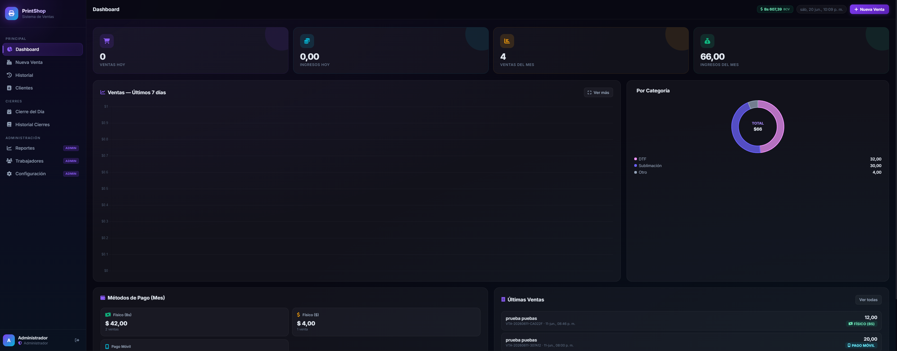

<div align="center">

# 🖨️ PrintShop POS

### Point of Sale System for Print Shops

*Manage sales, clients, daily closings, payroll, and reports — all in one place*

[](https://php.net)
[](https://mysql.com)
[](#license)
[](#payment-methods)
[](#telegram-notifications)

<br/>



</div>

---

## What is PrintShop POS?

**PrintShop POS** is a complete web-based point of sale system designed for print shops in Venezuela. It allows you to register sales with prices in dollars and automatic conversion to bolivars using the official BCV exchange rate, manage clients, track employee payroll, close the day with a detailed summary, and generate fully customizable invoices.

Built with plain PHP + MySQL — no server-side frameworks or extra dependencies — making it easy to deploy on any shared hosting or VPS.

---

## Features

### Sales & Payments
- **Fast sales registration** with multiple products/services per transaction
- **4 payment methods**: Cash Bs, Cash USD, Mobile Payment, and Mixed (free combination)
- **Mobile Payment**: reference number field and image upload for receipt
- **Mixed payment**: flexible breakdown by method, with sum validation
- **Discounts** per sale (fixed amount)
- **Real-time client search** with autocomplete (name, ID, phone)
- **Automatic BCV rate** — USD→Bs conversion on every sale (30-min cache with fallback)

### Service Catalog
- 6 built-in categories: **Sublimation, DTF, Textile Vinyl, Cut Vinyl, Print Vinyl, Printing**
- Each category with its own color and icon
- Quick-add buttons by category on the sales form

### Invoicing
- Invoice generated on screen instantly after each sale
- Direct print (`Ctrl+P`) or **PDF download** (jsPDF + html2canvas)
- Full visual customization: header, footer, row and total colors
- Business logo support (PNG/JPG with transparent background)
- Configurable texts: title, subtitle, footer note

### Dashboard & Reports
- **Dashboard** with today's and monthly metrics: sales count and revenue
- Bar chart for the last 7 days
- Donut chart by service category
- Revenue breakdown by payment method
- **Reports** (admin only): weekly, monthly, annual and per-employee
- Charts powered by **Chart.js**

### Daily Closings
- End-of-day closing with totals by payment method and category
- Closing history with trend chart for the last 30 days
- One closing per day (duplicate protection)
- Optional notes per closing

### Client Management
- Full CRUD: individuals and companies (ID / RIF)
- Search by name, ID, or phone number
- Paginated list of 30 records per page
- Internal notes per client

### Employees & Payroll
- Full employee CRUD with personal details
- Mobile Payment fields: bank, phone, and ID
- Payroll payments in USD with automatic Bs conversion
- Payment receipt image upload
- Payment history per employee
- Role management: `admin` and `seller`

### Telegram Notifications
- Automatic notification on every new sale
- Notification when the day is closed
- Configurable by event type (sales / closings)
- Setup from the admin panel

### Security
- Passwords with `bcrypt` (cost 12)
- Sessions with `HTTPOnly`, `SameSite=Strict`, and ID regeneration on login
- All SQL queries use prepared statements (PDO)
- Role-based access control on every route and endpoint
- File uploads with MIME type validation

---

## Tech Stack

| Layer | Details |
|-------|---------|
| Backend | PHP 8.2 — PDO/MySQL, no frameworks |
| Database | MySQL 5.7+ / MariaDB 10.3+ |
| Frontend | HTML5 + CSS3 + Vanilla JavaScript |
| Charts | [Chart.js 4.4](https://www.chartjs.org/) |
| PDF | [jsPDF](https://github.com/parallax/jsPDF) + [html2canvas](https://html2canvas.hertzen.com/) |
| Icons | [Font Awesome 6.5](https://fontawesome.com/) |
| Fonts | [Inter](https://fonts.google.com/specimen/Inter) — Google Fonts |
| Server | Apache 2.4 + mod_rewrite (or Nginx) |
| External API | [ve.dolarapi.com](https://ve.dolarapi.com) — Official BCV rate |

---

## Requirements

- PHP **8.1 or higher** (`match`, `str_starts_with`, catch without variable)
- MySQL **5.7+** or MariaDB **10.3+**
- PHP extensions: `pdo_mysql`, `json`, `fileinfo`, `mbstring`
- Apache with `AllowOverride All` (or Nginx equivalent)
- Server internet access (for the BCV rate API)

---

## Installation

### 1 — Clone the repository

```bash
git clone https://github.com/Jhezuann-Kael/printshop-pos.git /var/www/html/negocio
cd /var/www/html/negocio
```

### 2 — Create the database

```sql
CREATE DATABASE negocio_ventas
  CHARACTER SET utf8mb4
  COLLATE utf8mb4_unicode_ci;

CREATE USER 'negocio_user'@'localhost' IDENTIFIED BY 'YourSecurePassword';
GRANT ALL PRIVILEGES ON negocio_ventas.* TO 'negocio_user'@'localhost';
FLUSH PRIVILEGES;
```

Import the full schema (tables + seed data):

```bash
mysql -u negocio_user -p negocio_ventas < database.sql
```

> The script creates all tables, inserts the default **admin** user with password `Admin2024!` and the 6 default service categories. **Change the password after first login.**

### 3 — Set up environment variables

```bash
cp .env.example .env
nano .env
```

```env
DB_HOST=localhost
DB_NAME=negocio_ventas
DB_USER=negocio_user
DB_PASS=YourSecurePassword
APP_TIMEZONE=America/Caracas
```

### 4 — Upload folder permissions

```bash
chown -R www-data:www-data uploads/
chmod -R 775 uploads/
```

### 5 — Apache virtual host

```apache
<VirtualHost *:80>
    ServerName printshop.yourdomain.com
    DocumentRoot /var/www/html/negocio

    <Directory /var/www/html/negocio>
        AllowOverride All
        Require all granted
    </Directory>
</VirtualHost>
```

### 6 — First login

Open your browser and log in with:

| Field | Value |
|-------|-------|
| Username | `admin` |
| Password | `Admin2024!` |

Then go to **Settings** to fill in your business name, upload your logo, customize invoice colors, and optionally set up Telegram notifications.

---

## Getting Started

```
1. Settings      →  Fill in business info + logo
2. Employees     →  Create seller accounts
3. New Sale      →  Start selling!
4. Daily Closing →  Run at the end of each workday
```

---

## Payment Methods

| Code | Description | Extra fields |
|------|-------------|-------------|
| `fisico_bs` | Cash in bolivars | — |
| `fisico_usd` | Cash in dollars | — |
| `pago_movil` | Mobile Payment (bank transfer) | Reference number + receipt image |
| `mixto` | Free combination of methods | Breakdown with sum validation |

---

## Roles & Permissions

| Module | Admin | Seller |
|--------|:-----:|:------:|
| Dashboard | ✅ | ✅ |
| New Sale | ✅ | ✅ |
| Sales History | ✅ | ✅ |
| Clients | ✅ | ✅ |
| Daily Closing | ✅ | ✅ |
| Closing History | ✅ | ✅ |
| Reports | ✅ | ❌ |
| Employees | ✅ | ❌ |
| Settings | ✅ | ❌ |
| Cancel sales | ✅ | ❌ |

---

## Telegram Notifications

**1. Create the bot**

Open [@BotFather](https://t.me/BotFather) on Telegram and run:
```
/newbot
```
Copy the **token** it gives you.

**2. Get the Chat ID**

Send a message to your bot, then open this URL (replace `TOKEN`):
```
https://api.telegram.org/botTOKEN/getUpdates
```
Look for `"chat": {"id": XXXXXXX}` — that's your Chat ID.

**3. Configure in the system**

Go to **Settings → Telegram**, paste the token and chat ID, enable the events you want, and save.

**What the bot sends:**
- 🧾 New sale: number, client, total, Bs equivalent, method and items
- 📊 Daily closing: date, sale count, total and breakdown by method

---

## Security

| Aspect | Implementation |
|--------|---------------|
| Passwords | `password_hash()` with bcrypt (cost 12) |
| Sessions | `HTTPOnly`, `SameSite=Strict`, ID regeneration on login |
| SQL | PDO prepared statements — no string concatenation |
| XSS | `htmlspecialchars()` on all PHP outputs |
| File uploads | MIME type validation + timestamp-based filenames |
| Upload dirs | Protected with `index.php` returning 403 |
| Credentials | Never in the repo — always in `.env` |
| Access control | `requireLogin()` and `requireAdmin()` on every route |

---

## Production Checklist

```
[ ] Change the default admin password
[ ] Set up HTTPS (Let's Encrypt / Certbot)
[ ] Set session.cookie_secure = On in php.ini
[ ] Set permissions: uploads/ 775, PHP files 644
[ ] Disable display_errors in php.ini
[ ] Set up automated database backups
[ ] Add business info in Settings
[ ] Upload business logo
[ ] (Optional) Set up Telegram bot
```

---

## License

This project is licensed under the **MIT License**. You are free to use, modify, and distribute it, including for commercial purposes.

---

<div align="center">

Built with 💜 for Venezuelan print shops

</div>
